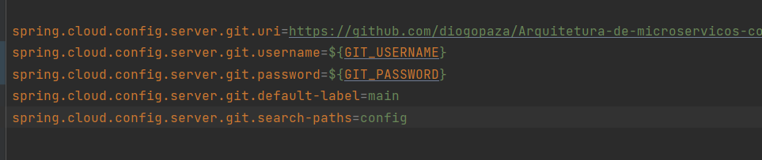

# Arquitetura-de-microservicos-com-Spring-Cloud

<!DOCTYPE html>
<html lang="pt-BR">
<head>
  <meta charset="UTF-8" />
  <meta name="viewport" content="width=device-width, initial-scale=1" />
  <title>Plano de Evolução Progressiva para Microsserviços</title>
  
</head>
<body>

  <h1>🚀 Plano de Evolução Progressiva para Microsserviços — Com Roteiro de Testes Práticos</h1>

  <section>
    <h2>🏗️ Fase 1 — Arquitetura Básica Funcional (Fundação)</h2>

    <h3>✅ O que implementar:</h3>
    <ul>
      <li>Config Server</li>
      <li>Eureka Server</li>
      <li>Gateway</li>
      <li>Microsserviço de Pedidos (<code>pedido-service</code>) com arquitetura em camadas (<code>controller → service → repository</code>).</li>
    </ul>

    <h3>🧪 Roteiro de Testes:</h3>

    <h4>🔗 Teste 1 — Eureka funcionando</h4>
    
Acesse <a href="http://localhost:8761" target="_blank">http://localhost:8761</a>

    
<strong>Esperado:</strong> Veja o <code>pedido-service</code>, <code>gateway</code> e <code>config-server</code> registrados.

    <h4>🔧 Teste 2 — Gateway funcionando</h4>
    
No Postman ou navegador:

    <pre>GET http://localhost:8080/pedido-service/actuator/health</pre>
    
<strong>Esperado:</strong> <code>{ "status": "UP" }</code>

    <h4>🗂️ Teste 3 — Configuração centralizada</h4>
    
Pare o <code>Config Server</code> e suba o <code>pedido-service</code>.

    
<strong>Esperado:</strong> O <code>pedido-service</code> não sobe, erro relacionado a <code>Config Server not available</code>.

    <h4>🔨 Teste 4 — CRUD básico do pedido</h4>
    
No Postman:

    <pre>
POST http://localhost:8080/pedido-service/api/pedidos
Body:
{
  "descricao": "Teste de pedido",
  "valor": 120.0
}
    </pre>
    
<strong>Esperado:</strong> Código 201 Created, e resposta com o objeto salvo (ID preenchido).

    
Valide com:

    <pre>GET http://localhost:8080/pedido-service/api/pedidos</pre>
    
<strong>Esperado:</strong> Lista com seu pedido criado.

  </section>

  <section>
    <h2>🔄 Fase 2 — Comunicação entre Microsserviços</h2>

    <h3>✅ O que implementar:</h3>
    <ul>
      <li>Microsserviço de Pagamentos (<strong>REST — síncrono</strong>)</li>
      <li>Microsserviço de Emails (<strong>RabbitMQ — assíncrono</strong>)</li>
      <li>RabbitMQ configurado</li>
    </ul>

    <h3>🧪 Roteiro de Testes:</h3>

    <h4>🔗 Teste 1 — Comunicação síncrona Pedido ↔️ Pagamento</h4>
    
No Postman:

    <pre>POST http://localhost:8080/pedido-service/api/pedidos/1/pagar</pre>
    
<strong>Esperado:</strong> Pedido atualizado como <code>PAGO</code>. Verifique logs do <code>pagamento-service</code>.

    <h4>📨 Teste 2 — Comunicação assíncrona Pedido → Email via RabbitMQ</h4>
    
Ao criar um pedido:

    <pre>POST http://localhost:8080/pedido-service/api/pedidos</pre>
    
<strong>Esperado:</strong> No log do <code>email-service</code>: <code>[EMAIL] Enviando email de confirmação para pedido ID: X</code>.

    
Verifique no RabbitMQ Management (<a href="http://localhost:15672" target="_blank">http://localhost:15672</a>) se as filas estão processando.

  </section>

  <section>
    <h2>🔗 Fase 3 — Resiliência e Observabilidade</h2>

    <h3>✅ O que implementar:</h3>
    <ul>
      <li>Circuit Breaker com Resilience4j</li>
      <li>Retry, Timeout e Fallback</li>
      <li>Monitoramento com Actuator, Prometheus e Zipkin</li>
    </ul>

    <h3>🧪 Roteiro de Testes:</h3>

    <h4>⚠️ Teste 1 — Circuit Breaker</h4>
    
Desligue o <code>pagamento-service</code>.

    
No Postman:

    <pre>POST http://localhost:8080/pedido-service/api/pedidos/1/pagar</pre>
    
<strong>Esperado:</strong> Retorno com fallback informando indisponibilidade do pagamento.

    <h4>🔁 Teste 2 — Retry + Timeout</h4>
    
Simule lentidão no <code>pagamento-service</code>.

    
Verifique nos logs do <code>pedido-service</code> os retries e timeout.

    <h4>🔎 Teste 3 — Traceabilidade</h4>
    
Gere uma requisição e acompanhe o trace no Zipkin (<a href="http://localhost:9411" target="_blank">http://localhost:9411</a>).

  </section>

  <section>
    <h2>🧠 Fase 4 — Arquitetura Hexagonal</h2>

    <h3>✅ O que implementar:</h3>
    <ul>
      <li>Refatoração para arquitetura Hexagonal</li>
      <li>Criação dos módulos: Domain, Application, Adapters</li>
    </ul>

    <h3>🧪 Roteiro de Testes:</h3>

    <h4>✅ Teste 1 — Validação funcional após refatoração</h4>
    
Execute os mesmos testes de CRUD da Fase 1 e integração da Fase 2.

    <h4>🧠 Teste 2 — Teste Unitário orientado a domínio</h4>
    <pre>
Pedido pedido = new Pedido();
pedido.marcarComoPago();
assertTrue(pedido.isPago());
    </pre>
  </section>

  <section>
    <h2>🔒 Fase 5 — Segurança</h2>

    <h3>✅ O que implementar:</h3>
    <ul>
      <li>JWT</li>
      <li>Spring Security no Gateway e nos serviços</li>
    </ul>

    <h3>🧪 Roteiro de Testes:</h3>

    <h4>🔑 Teste 1 — Obter Token</h4>
    <pre>
POST http://localhost:8080/auth/login
Body:
{
  "username": "admin",
  "password": "123"
}
    </pre>
    
<strong>Esperado:</strong> Retorno com JWT.

    <h4>🔐 Teste 2 — Acesso protegido</h4>
    <ul>
      <li>Sem token → 401 Unauthorized</li>
      <li>Com token → Acesso permitido</li>
    </ul>
  </section>

  <section>
    <h2>🚀 Fase 6 — CI/CD e Deploy</h2>

    <h3>✅ O que implementar:</h3>
    <ul>
      <li>Pipelines no GitHub Actions para build, teste, análise estática e deploy</li>
      <li>Docker Compose para orquestração local de múltiplos microsserviços</li>
      <li>Deploy em Kubernetes (GKE, EKS, AKS, ou clusters locais)</li>
      <li>Configuração de manifests (YAML) para Deployments, Services, ConfigMaps e Secrets</li>
      <li>Monitoramento dos jobs e logs do pipeline CI/CD</li>
      <li>Integração de testes automatizados no pipeline</li>
    </ul>

    <h3>🧪 Roteiro de Testes:</h3>

    <h4>🔧 Teste 1 — Build automático no push</h4>
    
Configure um workflow GitHub Actions para:

    <ul>
      <li>Build do código</li>
      <li>Execução dos testes unitários e de integração</li>
      <li>Análise estática de código (SonarQube, ESLint etc)</li>
      <li>Build e push das imagens Docker para o registry (Docker Hub, ECR, GCR)</li>
      <li>Deploy automático em ambiente de teste (Staging)</li>
    </ul>

    <h4>🐳 Teste 2 — Docker Compose</h4>
    <pre>docker-compose up</pre>
    
<strong>Esperado:</strong> Todos os microsserviços sobem, se conectam e funcionam localmente.

    <h4>☸️ Teste 3 — Kubernetes</h4>
    <pre>
kubectl apply -f deployment.yaml
kubectl apply -f service.yaml
kubectl get pods
kubectl get services
kubectl logs <nome-do-pod>
    </pre>
    
<strong>Esperado:</strong> Pods rodando, serviços expostos, logs acessíveis.

    <h4>⚙️ Teste 4 — Atualização contínua (Rolling Update)</h4>
    
Realize uma atualização de versão do serviço e valide o comportamento sem downtime:

    <pre>kubectl set image deployment/pedido-service pedido-service=meu-registry/pedido-service:v2</pre>
    
Verifique pods novos rodando e antigos sendo finalizados gradualmente.

  </section>

  <section>
    <h2>🌐 Fase 7 — Cloud e Escalabilidade</h2>

    <h3>✅ O que implementar:</h3>
    <ul>
      <li>Clusters Kubernetes em cloud pública (AWS, GCP, Azure) com alta disponibilidade</li>
      <li>Configuração de autoscaling Horizontal Pod Autoscaler (HPA) baseado em CPU, memória ou métricas customizadas</li>
      <li>Deploy multi-region e failover automatizado</li>
      <li>Monitoramento avançado com Prometheus, Grafana e Alertmanager</li>
      <li>Configuração de Network Policies para segurança e isolamento</li>
      <li>Uso de Ingress Controllers para roteamento e TLS (cert-manager)</li>
      <li>Backup automático e recuperação de desastres (DR)</li>
    </ul>

    <h3>🧪 Roteiro de Testes:</h3>

    <h4>🔥 Teste 1 — Alta disponibilidade e escalabilidade</h4>
    <pre>kubectl scale deployment pedido-service --replicas=3</pre>
    
<strong>Esperado:</strong> Múltiplas réplicas do serviço rodando, balanceadas pelo Kubernetes.

    
Configure HPA com: 

    <pre>
kubectl autoscale deployment pedido-service --cpu-percent=50 --min=3 --max=10
    </pre>
    
Forçar carga de CPU e observar pods sendo escalados automaticamente.

    <h4>☁️ Teste 2 — Failover cloud</h4>
    
Simule falha em uma região ou zona:

    <ul>
      <li>Implemente deploy multi-region com cluster federado ou replicação de dados</li>
      <li>Verifique se o tráfego é redirecionado automaticamente para a região saudável</li>
      <li>Teste latência e consistência dos dados</li>
    </ul>

    <h4>🔒 Teste 3 — Network Policies e Segurança</h4>
    
Defina políticas para isolar comunicação entre namespaces e restrinja acesso:

    <pre>kubectl apply -f network-policy.yaml</pre>
    
Verifique bloqueios e permissões corretas.

    <h4>📊 Teste 4 — Monitoramento e alertas</h4>
    
Configure alertas no Prometheus Alertmanager para notificações via Slack, Email etc.

    
Simule falhas e observe alertas disparando.

------------------------------------------------

<h3>Servidor de configuracao - Config Server</h3>

O servidor de configuracao e um padrao que busca a externalizacao das configuracoes das aplicacoes de modo que todas
ficam centralizadas em um determinado recurso da arquitetura.

Uma das implementacoes desse design pattern e o Spring Config Server. Este possui diversos artefatos desde um diretororio no servidor ate repositorios Git, Amazon S3, banco de dados entre outros. Tambem possui funcionalidades como reaproveitamento de properties entre aplicacoes e atualizacao de properties sem a necessidade de reiniciar o servico.

<h4>Iniciando Spring Config Server</h4>

Sao necessarias 3 dependencias para rodar o config server com Spring:
  <ul>
    <li>spring-cloud-config-server</li>
    <li>spring-boot-starter-actuator</li>
    <li>spring-cloud-dependencies</li>
  </ul>

Proximo passo e necessario definir a anotacao <strong>@EnableConfigServer</strong> na classe principal do projeto do projeto Spring

Seguindo no application.properties sera definida as configuracoes de acesso ao repositorio GIT:
  

  

  Importante notar que usuario e senha estao sendo passados via variaveis de ambiente para nao expormos nosso usuario e senha no repositorio.

<h3>Padrao Arquitetura - Service Discovery</h3>

Uma das implementacoes desse padrao e o Spring Cloud Eureka Server. O primeiro passo e baixar a dependencia abaixo e habilitar a anotacao 
  <strong>@EnableEurekaServer</strong> na classe principal do projeto.:
   <ul>
    <li>spring-cloud-starter-netflix-eureka-server</li>
   
  </ul>
  
O Eureka Server e o responsavel por registrar os microservicos de dominio (pedidos, pagamentos, emails). Dessa forma nao e preciso saber em qual porta cada microservico inicializou e nem quantas instancias desse microservicos esta rodando.

<h4>Microservicos para teste do projeto</h4>

O primeiro microsservico sera o de pedido, alem desse teremos o de pagamentos usando comunicacao sincrona e o de emails usando comunicacao assincrona.

Inicialmente o microservico pedidiso ira implementar uma arquitetura baseada em camadas para iniciar o projeto e depois sera refatorado para a arquitetura hexagonal.

